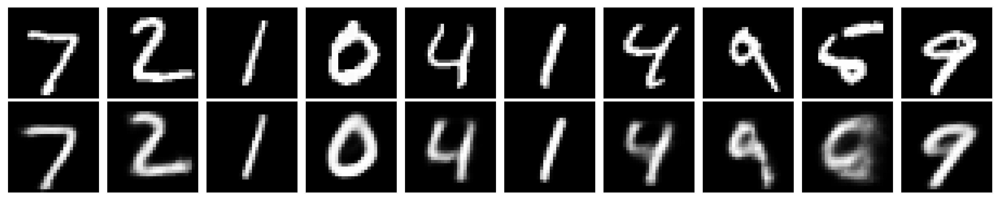
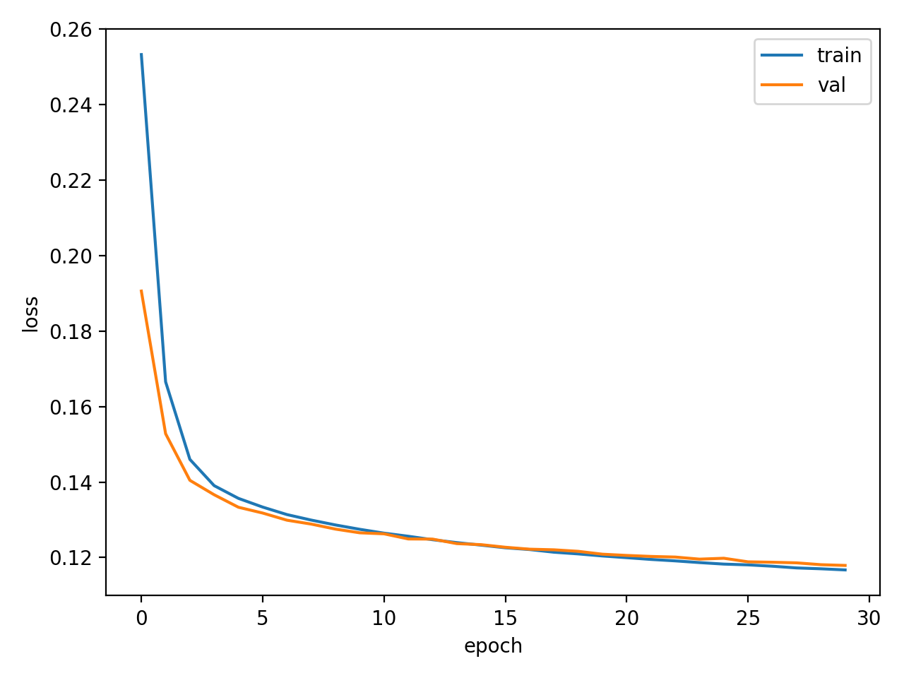
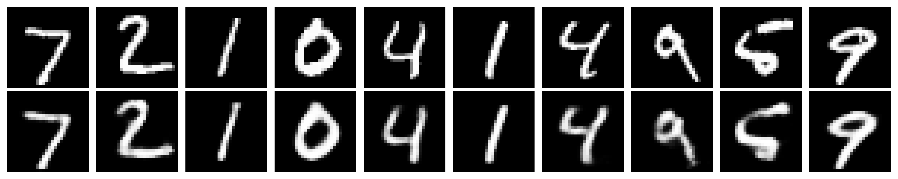
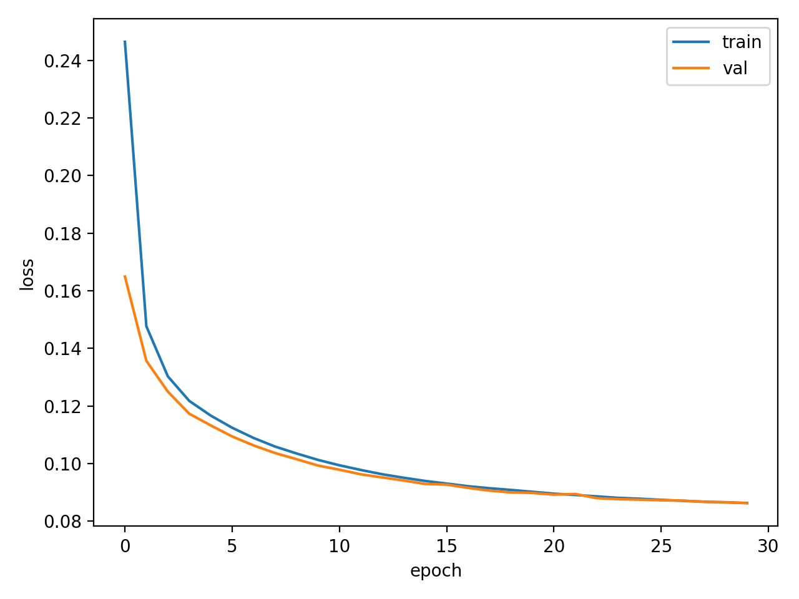
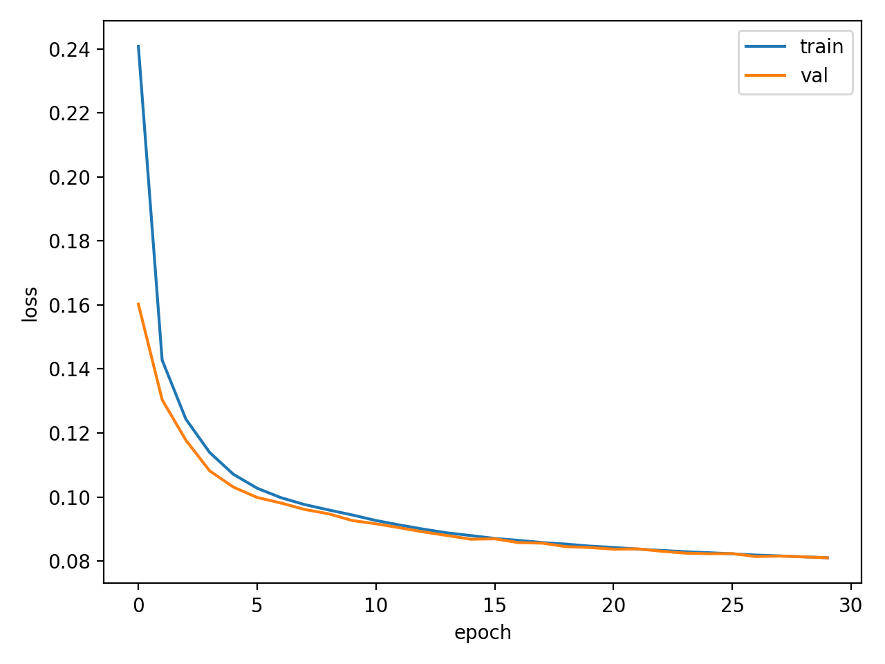
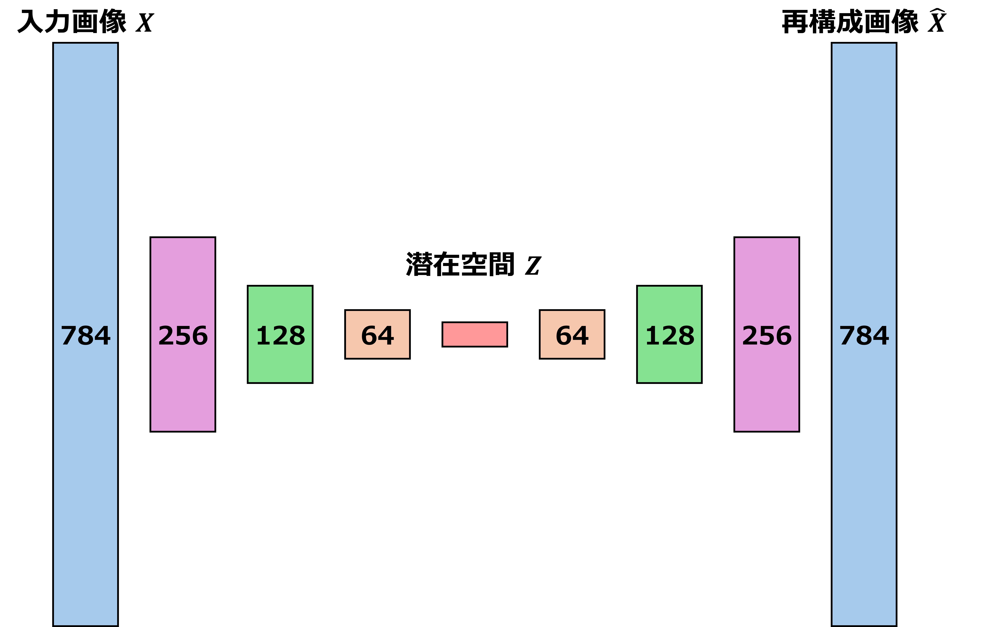

# アドバンスドビジョン - 課題
[](https://github.com/ryotarokarikomi/advanced_vision_2025/actions/workflows/test.yml)
<!------------------------>
## 概要
本リポジトリでは，オートエンコーダを用いて，MNIST手書き数字データセットに対して画像の次元圧縮および再構成をおこなった．

オートエンコーダは以下の2つのネットワークから構成されるニューラルネットワークである．
  - エンコーダ：入力データを低次元の潜在表現に写像
  - デコーダ：潜在表現から元の入力データを再構成

本実装では，全結合層を重ねた多層構造を採用し，
誤差逆伝播法によって入力と出力の再構成誤差を最小化するように学習を行った．
<!------------------------>

<!------------------------>
## 実行のためのセットアップ
### 動作確認済み環境
- **OS**：Ubuntu 24.04.3 LTS
- **Python**：3.12.3
#### 必要なライブラリ
- `tensorflow`
- `numpy`
- `matplotlib`
- `keras`
### リポジトリのクローン
```
git clone https://github.com/ryotarokarikomi/advanced_vision_2025.git
cd advanced_vision_2025
```
### 仮想環境の作成と有効化
```
python -m venv .venv
source .venv/bin/activate
```
### 依存ライブラリのインストール
```
pip install -r requirements.txt
```
<!------------------------>

<!------------------------>
## テスト
- **内容**：ダミーデータを用いたモデル構造のテスト
- **環境**
  - **OS**：Ubuntu（GitHub Actions，`ubuntu-latest`）
  - **Python**：3.12.x
<!------------------------>

<!------------------------>
## 実行方法
### デフォルト設定での実行
```
python src/main.py
```
**デフォルトのパラメータ**
- エポック数：100
- バッチサイズ：256
- 潜在表現の次元数：32
- 結果の保存先：`results/`
### パラメータを変更して実行
例）エポック数を20，潜在表現の次元数を16
```
python src/main.py --epochs 20 --encoding_dim 16
```
<!------------------------>

<!------------------------>
## 実行結果の例
エポック数を30に固定し，潜在表現の次元数（`encoding_dim`）が再構成画像の品質に与える影響を比較．

---
### 次元数8
```
python src/main.py --epochs 30 --encoding_dim 8 --out results/ep30dim8
```



---
### 次元数32
```
python src/main.py --epochs 30 --encoding_dim 32 --out results/ep30dim32
```



---
### 次元数128
```
python src/main.py --epochs 30 --encoding_dim 128 --out results/ep30dim128
```


<!------------------------>

<!------------------------>
---
## モデルの構造
本実装では，全結合層を積み重ねたオートエンコーダを実装した．
入力画像はMNIST手書き文字（28x28=784次元）であり，これを段階的に圧縮し，
再び元の次元へ復元する対称的な構造を持つ．
エンコーダとデコーダの2つのネットワークから構成される．

### ネットワーク構成

#### エンコーダ
- **入力層**：784次元
- **隠れ層1**：256次元（活性化関数：**ReLU**）
- **隠れ層2**：128次元（活性化関数：**ReLU**）
- **隠れ層3**：64次元（活性化関数：**ReLU**）
- **潜在空間**：任意の次元数（活性化関数：**ReLU**）
#### デコーダ
- **隠れ層1**：64次元（活性化関数：**ReLU**）
- **隠れ層2**：128次元（活性化関数：**ReLU**）
- **隠れ層3**：256次元（活性化関数：**ReLU**）
- **出力層**：784次元（活性化関数：**Sigmoid**）
#### 学習の設定
- **最適化アルゴリズム**：**Adam**
- **損失関数**：**Binary Cross-Entropy**

---
### 数式
本実装で用いたオートエンコーダは，入力データ $\mathbf{x} \in [0,1]^{784}$ を低次元の潜在表現へ写像し，
そこから元の入力を再構成するモデルである．
#### エンコーダ
入力を $\mathbf{x}$ ，潜在表現を $\mathbf{z}$，パラメータを $\theta$ とするとエンコーダは以下のように表される．

$$
\mathbf{z} = f_\theta(\mathbf{x})
$$

本モデルでは，全結合層と活性化関数ReLUを用いて構成する．
#### デコーダ
パラメータを $\phi$ とするとデコーダは以下のように表される．

$$
\hat{\mathbf{x}} = g_\phi(\mathbf{z})
$$

出力層にはSigmoid関数を用いて，画素値を $[0,1]$ の範囲に制限している．
#### 活性化関数
- **ReLU**

$$
\mathrm{ReLU}(x) = \max(0, x)
$$

- **Sigmoid**

$$
\sigma(x) = \frac{1}{1 + e^{-x}}
$$

#### 損失関数
本モデルでは再構成誤差としてBinary Cross-Entropyを用いた．
損失を $\mathcal{L}$ として， $\mathbf{x}$ と $\hat{\mathbf{x}}$ の誤差は以下のように表される．

$$
\mathcal{L}(\mathbf{x}, \hat{\mathbf{x}}) = -\sum_{i=1}^{784}\left[x_i \log \hat{x}_i + (1-x_i)\log(1-\hat{x}_i)\right]
$$

<!------------------------>

<!------------------------>
## 参考文献
[Building Autoencoders in Keras](https://blog.keras.io/building-autoencoders-in-keras.html)（Apache License, Version 2.0）
<!------------------------>

<!------------------------>
## ライセンス
このリポジトリは Apache License, Version 2.0に基づき公開されています．  
ライセンスの全文は[LICENSE](./LICENSE)または[https://www.apache.org/licenses/LICENSE-2.0](https://www.apache.org/licenses/LICENSE-2.0)から確認できます．  
© 2026 Ryotaro Karikomi
<!------------------------>
